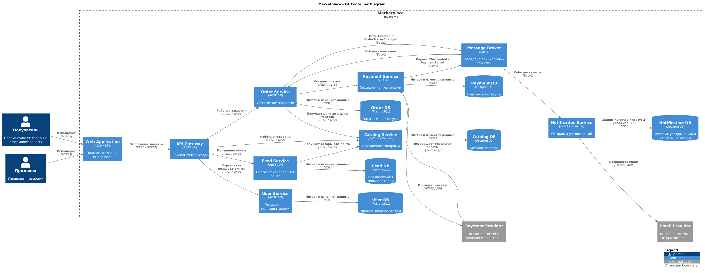

# HSE_SOA
Service-oriented architecture course at the Higher School of Economics

# HSE SOA — Marketplace

Нужно спроектировать архитектуру маркетплейса, где продавцы размещают товары, а покупатели смотрят ленту, оформляют и оплачивают заказы.

## Архитектура

Для маркетплейса выбрана микросервисная архитектура.

Система разделена на следующие сервисы:

- **User Service** — пользователи, профили и роли покупателя/продавца.
- **Catalog Service** — товары, категории, цены и остатки.
- **Feed Service** — персонализированная лента товаров.
- **Order Service** — создание заказов и изменение их статусов.
- **Payment Service** — создание и учёт платежей.
- **Notification Service** — отправка уведомлений о статусах заказов.

Перед сервисами находится **API Gateway**, который является единой точкой входа для клиента.

Для асинхронного обмена событиями используется **Kafka**.

## C4 Container Diagram



## Персонализация

Feed Service формирует ленту с учётом категорий товаров, которыми пользователь интересовался раньше.

Если данных о пользователе ещё нет, ему показываются популярные товары.

## Данные

Каждый сервис владеет своей базой данных:

- User Service → User DB
- Catalog Service → Catalog DB
- Feed Service → Feed DB
- Order Service → Order DB
- Payment Service → Payment DB
- Notification Service → Notification DB

Общая база данных между сервисами не используется.

Сервисы не обращаются напрямую к чужим БД. Например, если Order Service нужна информация о товаре, он запрашивает её через Catalog Service.

## Взаимодействие сервисов

Для запросов, где ответ нужен сразу, используется синхронное REST-взаимодействие.

Примеры:

- Feed Service → Catalog Service — получение товаров для ленты.
- Order Service → Catalog Service — получение информации и цены товара.
- Order Service → Payment Service — создание платежа.

Для сообщений о произошедших событиях используется Kafka.

Примеры событий:

- `PaymentSucceeded`
- `PaymentFailed`
- `OrderCreated`
- `OrderStatusChanged`

Например, после успешной оплаты Payment Service публикует событие `PaymentSucceeded`. Order Service получает его и изменяет статус заказа.

После изменения статуса заказа Order Service публикует `OrderStatusChanged`, которое получает Notification Service.

## Архитектурные решения

Сервисы разделены по бизнес-ответственности. Catalog отвечает только за товары, Order — за заказы, Payment — за платежи и т.д.

Отдельные базы данных выбраны для того, чтобы сервисы не зависели от внутренней структуры данных друг друга.

REST используется там, где результат нужен сразу. Kafka используется для событий, обработка которых может происходить асинхронно.

Payment Service выделен отдельно, так как работа с платежами является отдельной зоной ответственности и связана с внешней платёжной системой.

Notification Service также выделен отдельно, чтобы Order Service не зависел от конкретного способа отправки уведомлений.

## Альтернативные варианты

Рассматривались два варианта.

### Модульный монолит

Все функции находятся в одном приложении, но разделены на модули.

Плюсы:
- проще разрабатывать и запускать;
- меньше сетевых вызовов;
- проще тестирование и развертывание.

Минусы:
- всё приложение разворачивается целиком;
- сложнее независимо масштабировать части системы;
- со временем модули могут начать сильно зависеть друг от друга.

### Микросервисы

Каждая бизнес-область вынесена в отдельный сервис.

Плюсы:
- отдельные зоны ответственности;
- независимое развертывание;
- собственные данные у каждого сервиса;
- можно независимо масштабировать разные части системы.

Минусы:
- появляются сетевые ошибки и задержки;
- сложнее инфраструктура;
- необходимо поддерживать межсервисные контракты;
- появляется дополнительная инфраструктура, например Kafka.

Для этого проекта выбран микросервисный вариант, потому что требования хорошо разделяются на независимые бизнес-домены: пользователи, товары, рекомендации, заказы, платежи и уведомления.

Для небольшого реального проекта модульный монолит мог бы быть проще, но в рамках этого задания микросервисы позволяют явно показать границы сервисов и способы их взаимодействия.

## Docker

Для проверки контейнеризации реализован минимальный **Catalog Service** на FastAPI.

Бизнес-логики сервис не содержит.

Доступен health-check:

```text
GET /health
